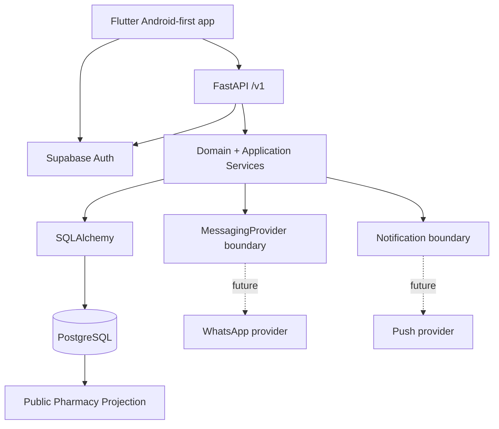

# NaviMed | نافيميد — Dental & Health Network

> A privacy-first healthcare coordination platform designed around authoritative scheduling, secure role/capability boundaries, and public pharmacy-duty discovery.

**Portfolio project:** MVP engineering implementation — not a production deployment.

[](https://github.com/mohds-rgb/NaviMed/actions/workflows/backend-ci.yml)
[](https://github.com/mohds-rgb/NaviMed/actions/workflows/mobile-ci.yml)
[](https://github.com/mohds-rgb/NaviMed/actions/workflows/security-scan.yml)

<p align="center">
  
</p>

## Project owner

**Mohammed Yaman ALdous**  
**Software Engineer | Full-Stack Developer**  
GitHub: [@mohds-rgb](https://github.com/mohds-rgb)  
Email: [moydous@gmail.com](mailto:moydous@gmail.com)

> The owner's name is intentionally not shown in the mobile app UI. It is used only in repository and engineering metadata.

## Product scope

NaviMed is an Android-first coordination platform for Syria with Arabic and English support. MVP scope includes:

- patient authentication, provider discovery, availability, booking, cancellation and rescheduling;
- provider/clinic scheduling and appointment lifecycle operations;
- independent pharmacy accounts and administrator-managed duty schedules;
- public daily on-duty pharmacy discovery with an explicit verification/publication gate;
- controlled emergency-contact publication;
- in-app, push-notification and WhatsApp integration boundaries;
- limited appointment coordination notes, deliberately separated from a full medical-record system.

NaviMed is a **care-coordination and service-discovery system**, not a diagnostic or clinical decision-support product. Availability and emergency information are only considered authoritative after approved operational publication.

## Architecture



Supabase Auth is the identity/session provider only. FastAPI is the trusted application boundary and derives platform roles, clinic memberships and capabilities from server-side state.

## Security-oriented engineering

The repository treats the following as business invariants rather than UI concerns:

- server-authoritative appointment state;
- row locking plus database uniqueness for slot consumption;
- idempotency keys with request hashes for retry-safe mutations;
- clinic membership, capability and object-level authorization;
- append-only appointment events and audit records;
- public/private pharmacy data separation;
- explicit provider approval and pharmacy duty verification gates;
- controlled emergency-contact replacement;
- structured logging with sensitive-key redaction;
- bounded local cache that never becomes the source of truth.

See `SECURITY.md`, `SECURITY_RISK_REGISTER.md`, `docs/SAFETY_SPEC.md`, and `docs/PRIVACY_SPEC.md`.

## Data privacy policy for this public repository

This GitHub repository intentionally contains **no real patient data, no real medical records, and no unnecessary personal data belonging to providers, clinic staff, pharmacies, or emergency contacts**.

Real operational datasets are provisioned outside version control through controlled administration/import workflows. The application schema and validation rules are designed to accept real data without requiring real data to be committed to source control.

Synthetic fixtures may exist only for automated tests or an explicitly invoked local fixture command. They are not presented as real users, clinics, pharmacies, appointments, customers, revenue, or production activity.

## Repository structure

```text
NaviMed/
├── backend/
│   ├── app/
│   │   ├── api/routes/
│   │   ├── core/
│   │   ├── db/
│   │   ├── domain/
│   │   ├── schemas/
│   │   ├── services/
│   │   └── middleware/
│   ├── migrations/
│   └── tests/
├── mobile/
│   ├── assets/
│   ├── lib/core/
│   ├── lib/features/
│   └── android/
├── docs/
│   ├── adr/
│   ├── architecture/
│   ├── security/
│   └── ...
├── .github/
│   ├── workflows/
│   ├── ISSUE_TEMPLATE/
│   └── CODEOWNERS
└── project-control files
```

## Local development

### Backend

Requirements: Python 3.12+; Docker is recommended for PostgreSQL.

```bash
cp .env.example .env
cd backend
python -m venv .venv
# activate the virtual environment
pip install -e ".[dev]"
cd ..
docker compose up --build
```

The repository does not ship production credentials. Supabase credentials are passed through environment variables.

API docs: `http://localhost:8000/docs`

### Mobile

Flutter SDK 3.35+ and Dart 3.9+ are expected for the checked dependency set.

```bash
cd mobile
flutter pub get
flutter run \
  --dart-define=NAVIMED_API_BASE_URL=http://10.0.2.2:8000/v1 \
  --dart-define=SUPABASE_URL=https://YOUR-PROJECT.supabase.co \
  --dart-define=SUPABASE_ANON_KEY=YOUR_PUBLIC_ANON_KEY
```

The current assembly environment does not contain Flutter/Android SDK, so the mobile build is **not claimed as locally verified in this artifact**.

## Verification evidence

The latest assembly evidence is intentionally conservative:

| Check | Result | Evidence |
|---|---|---|
| Python compile | PASS | `python -m compileall ...` |
| Backend tests | PASS | 18 tests in the assembly environment |
| Backend module import sweep | PASS | 33 modules |
| FastAPI OpenAPI generation | PASS | 45 total OpenAPI paths (44 under `/v1` plus `/health`) |
| Alembic SQLite upgrade/downgrade smoke test | PASS | portability smoke test only |
| Ruff | NOT RUN | tool unavailable in offline assembly environment |
| Flutter analyze/test/build | NOT RUN | Flutter SDK unavailable |
| PostgreSQL migration/concurrency | NOT RUN | PostgreSQL/Docker unavailable |
| Supabase live Auth | NOT RUN | no project credentials |
| WhatsApp delivery | NOT RUN | provider not selected |
| CI execution | NOT RUN HERE | workflows are included for GitHub |
| Real device smoke test | NOT RUN | Android SDK/device unavailable |

Do not read a `PASS` above as evidence of production deployment or real-world healthcare operation.

## Portfolio review path

A reviewer can start with:

1. `docs/ARCHITECTURE.md` — system boundaries and authorization model.
2. `docs/DATA_MODEL.md` — relational aggregates and invariants.
3. `docs/API_CONTRACT.md` — API surface and mutation conventions.
4. `backend/app/services/appointments.py` — concurrency-aware booking lifecycle.
5. `backend/tests/` — executable business-invariant coverage.
6. `docs/adr/` — why key architecture choices were made.
7. `docs/PORTFOLIO.md` — implementation, evidence, and known limitations.

## Status labels

**IMPLEMENTED** = source exists and is connected in the repository.  
**VERIFIED** = executed successfully in the documented environment.  
**DESIGNED** = boundary/schema is intentionally defined but not live-integrated.  
**PLANNED** = requires an owner/provider/legal/hosting decision or unavailable runtime.

## License

All Rights Reserved © 2026 Mohammed Yaman ALdous.  
This project is **proprietary** and **not open-source**. See the [LICENSE](LICENSE) file for details.
