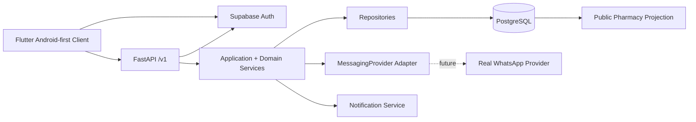

# NaviMed Architecture

## System boundary



## Backend layers

- **Transport:** FastAPI routes, validation, HTTP semantics, request IDs.
- **Authentication:** Supabase JWT verification using issuer/JWKS.
- **Authorization:** server-derived user, platform role, clinic membership, capability and resource ownership.
- **Application services:** named commands such as hold slot, create appointment, transition appointment, reschedule, verify duty schedule, publish duty schedule.
- **Domain:** explicit state transitions and invariant checks independent of HTTP.
- **Persistence:** SQLAlchemy repositories/models backed by PostgreSQL.
- **Integration:** messaging provider abstraction; no appointment domain dependency on a provider SDK.
- **Audit/observability:** append-only business events plus audit logs and structured request logging.

## Mobile layers

- presentation/screens/widgets
- API boundary
- Auth boundary
- bounded local safe-read cache and migration metadata
- theme/localization

The mobile cache is never an authority for appointment, provider, pharmacy publication, or security state.

## Tenant model

Clinic is the operational tenant boundary for provider/staff workflows. Clinic membership defines role/capability. Platform roles (`owner`, `platformAdmin`, `supportAdmin`) are server-side only and are never client-selectable.

## Appointment consistency

The write path is conceptually:

```text
request validation
→ Supabase JWT verification
→ user/tenant resolution
→ capability/object authorization
→ idempotency lookup
→ row lock on slot/appointment
→ state/policy validation
→ mutation
→ audit/event
→ commit
→ response
```

PostgreSQL transactions provide the atomic boundary. PostgreSQL supports transaction isolation and row-level locking; constraints are used as a second integrity barrier.

## Public data boundary

`public_pharmacy_duty_listings` is an explicit read model. It contains only public-facing fields and is never writable by the mobile client.


## Account and capability roles

The MVP supports patient, provider/dentist, clinic staff roles (such as clinic manager/receptionist), pharmacy accounts, city duty coordination and platform administration. Roles are server-side classifications; effective access is derived from capabilities and clinic/organization scope.

## Notification boundary

In-app notifications are persisted in PostgreSQL. Device registrations provide the boundary for future push delivery. WhatsApp remains a separate messaging integration and is never treated as the source of appointment truth.
